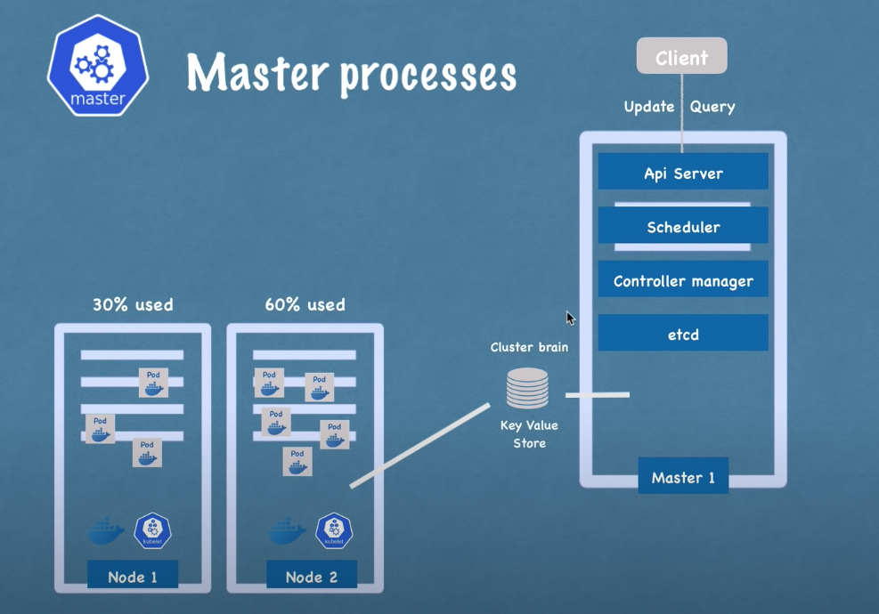

# Kubernetes Concept

### Why kubernetes

- help to manage containerized
- manage container in different environment (vm , machine, cloud, hybrid cloud)
- if you have 10k container how you manage them

### Features

- High availability - no downtime
- Scalability - high performance
- Disaster recovery - backup and restore

### Kubernetes component

- **Node** - physical server or vm
- **Pod**
  - smallest unit of kubernetes
  - abstraction over container
  - usually 1 application per pod
  - each pod gets its own IP address
  - new IP address on re-create
- **Service**
  - abstraction of IP address service on pod
  - fix problem new IP address on re-create
- **Ingress**
  - the door for user come in kubernetes
- **ConfigMap**
  - external configuration of app
  - if you didn't want to rebuild pod when edit config in service use config map
- **Secret**
  - external configuration of app but secret
- **Volumes**
  - storage on local machine or remote
- **Deployment**
  - blueprint for app pod
  - abstraction of pod
  - define replica of pod
- **StatefulSet**
  - like a deployment but for stateful app or db
  - not easy

### Kubernetes Architecture

- Worker node

- Master node

### Layers of Abstraction

- Deployment manage ReplicaSet
- ReplicaSet manage pod
- Pod is abstraction of container