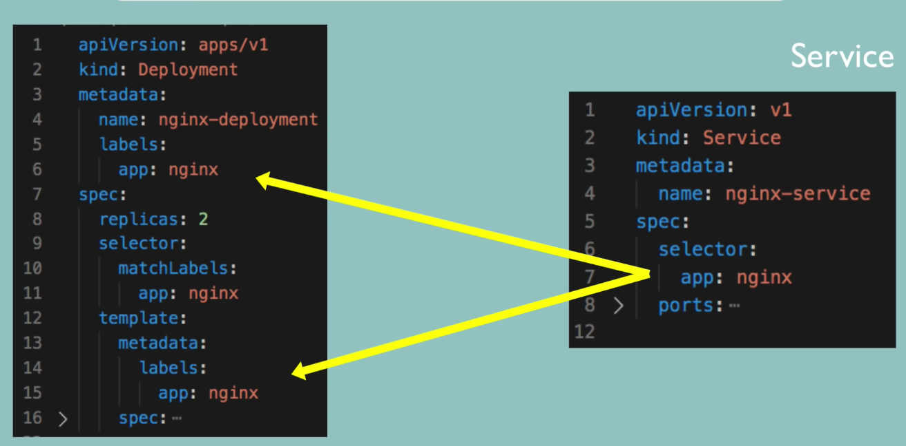

# Kubernetes Deployment file

- meta data
- specification
  - it has different config depend on **kind** (deployment, service) 
- status (keep in etcd) it's actually pod status
  - status compare specification
  - kubernetes try to status = specification

## Service match deployment from labels 




## Example

deployment-config.yml

```yaml
apiVersion: apps/v1
kind: Deployment
metadata:
  name: nginx
  labels:
    app: nginx 
spec:
  replicas: 2
  selector:
    matchLabels:
      app: nginx 
  template:
    metadata:
      labels:
        app: nginx
    spec:
      containers:
        - name: nginx
          image: nginx:1.16
          ports:
            - containerPort: 8080
```

service-config.yml

```yaml
apiVersion: v1
kind: Service
metadata:
  name: nginx-service
spec:
  selector:
    app: nginx 
  ports:
    - protocol: TCP
      port: 80
      targetPort: 8080
```

**!Note**
  - selector.app (service-config.yml) map with labels.app (deployment-config.yml) 
  - user connect -> 80 service nginx -> 8080 pod nginx

### Verify connection service & pod 

Service

```
➜  ~ kubectl describe service nginx-service
Name:              nginx-service
Namespace:         default
Labels:            <none>
Annotations:       <none>
Selector:          app=nginx
Type:              ClusterIP
IP:                10.109.81.39
Port:              <unset>  80/TCP
TargetPort:        8080/TCP
Endpoints:         172.17.0.4:8080,172.17.0.5:8080
Session Affinity:  None
Events:            <none>
  ```

Pod

```
➜  ~ kubectl get pod -o wide               
NAME                     READY   STATUS    RESTARTS   AGE     IP           NODE       NOMINATED NODE   READINESS GATES
mongo-56974b67f6-4glsw   1/1     Running   0          114m    172.17.0.3   minikube   <none>           <none>
nginx-f4b7bbcbc-7mftc    1/1     Running   0          5m43s   172.17.0.5   minikube   <none>           <none>
nginx-f4b7bbcbc-sbd6g    1/1     Running   0          5m43s   172.17.0.4   minikube   <none>           <none>
```


Status of deployment

```
➜  ~ kubectl get deployment nginx -o yaml
apiVersion: apps/v1
kind: Deployment
metadata:
  annotations:
    deployment.kubernetes.io/revision: "1"
    kubectl.kubernetes.io/last-applied-configuration: |
      {"apiVersion":"apps/v1","kind":"Deployment","metadata":{"annotations":{},"labels":{"app":"nginx"},"name":"nginx","namespace":"default"},"spec":{"replicas":2,"selector":{"matchLabels":{"app":"nginx"}},"template":{"metadata":{"labels":{"app":"nginx"}},"spec":{"containers":[{"image":"nginx:1.16","name":"nginx","ports":[{"containerPort":8080}]}]}}}}
  creationTimestamp: "2021-03-13T23:20:06Z"
  generation: 1
  labels:
    app: nginx
  managedFields:
  - apiVersion: apps/v1
    fieldsType: FieldsV1
    fieldsV1:
      f:metadata:
        f:annotations:
          .: {}
          f:kubectl.kubernetes.io/last-applied-configuration: {}
        f:labels:
          .: {}
          f:app: {}
      f:spec:
        f:progressDeadlineSeconds: {}
        f:replicas: {}
        f:revisionHistoryLimit: {}
        f:selector:
          f:matchLabels:
            .: {}
            f:app: {}
        f:strategy:
          f:rollingUpdate:
            .: {}
            f:maxSurge: {}
            f:maxUnavailable: {}
          f:type: {}
        f:template:
          f:metadata:
            f:labels:
              .: {}
              f:app: {}
          f:spec:
            f:containers:
              k:{"name":"nginx"}:
                .: {}
                f:image: {}
                f:imagePullPolicy: {}
                f:name: {}
                f:ports:
                  .: {}
                  k:{"containerPort":8080,"protocol":"TCP"}:
                    .: {}
                    f:containerPort: {}
                    f:protocol: {}
                f:resources: {}
                f:terminationMessagePath: {}
                f:terminationMessagePolicy: {}
            f:dnsPolicy: {}
            f:restartPolicy: {}
            f:schedulerName: {}
            f:securityContext: {}
            f:terminationGracePeriodSeconds: {}
    manager: kubectl-client-side-apply
    operation: Update
    time: "2021-03-13T23:20:06Z"
  - apiVersion: apps/v1
    fieldsType: FieldsV1
    fieldsV1:
      f:metadata:
        f:annotations:
          f:deployment.kubernetes.io/revision: {}
      f:status:
        f:availableReplicas: {}
        f:conditions:
          .: {}
          k:{"type":"Available"}:
            .: {}
            f:lastTransitionTime: {}
            f:lastUpdateTime: {}
            f:message: {}
            f:reason: {}
            f:status: {}
            f:type: {}
          k:{"type":"Progressing"}:
            .: {}
            f:lastTransitionTime: {}
            f:lastUpdateTime: {}
            f:message: {}
            f:reason: {}
            f:status: {}
            f:type: {}
        f:observedGeneration: {}
        f:readyReplicas: {}
        f:replicas: {}
        f:updatedReplicas: {}
    manager: kube-controller-manager
    operation: Update
    time: "2021-03-13T23:20:08Z"
  name: nginx
  namespace: default
  resourceVersion: "6562"
  selfLink: /apis/apps/v1/namespaces/default/deployments/nginx
  uid: 133301f7-2c96-4c73-b326-67205e79c451
spec:
  progressDeadlineSeconds: 600
  replicas: 2
  revisionHistoryLimit: 10
  selector:
    matchLabels:
      app: nginx
  strategy:
    rollingUpdate:
      maxSurge: 25%
      maxUnavailable: 25%
    type: RollingUpdate
  template:
    metadata:
      creationTimestamp: null
      labels:
        app: nginx
    spec:
      containers:
      - image: nginx:1.16
        imagePullPolicy: IfNotPresent
        name: nginx
        ports:
        - containerPort: 8080
          protocol: TCP
        resources: {}
        terminationMessagePath: /dev/termination-log
        terminationMessagePolicy: File
      dnsPolicy: ClusterFirst
      restartPolicy: Always
      schedulerName: default-scheduler
      securityContext: {}
      terminationGracePeriodSeconds: 30
status:
  availableReplicas: 2
  conditions:
  - lastTransitionTime: "2021-03-13T23:20:08Z"
    lastUpdateTime: "2021-03-13T23:20:08Z"
    message: Deployment has minimum availability.
    reason: MinimumReplicasAvailable
    status: "True"
    type: Available
  - lastTransitionTime: "2021-03-13T23:20:06Z"
    lastUpdateTime: "2021-03-13T23:20:08Z"
    message: ReplicaSet "nginx-f4b7bbcbc" has successfully progressed.
    reason: NewReplicaSetAvailable
    status: "True"
    type: Progressing
  observedGeneration: 1
  readyReplicas: 2
  replicas: 2
  updatedReplicas: 2
```