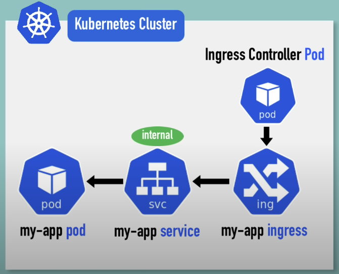

# Ingress



- must install ingress controller pod
- ingress component
- service
- pod


We expose minikube dashboard with ingress

- start minikube dashboard ```minikube dashboard```
  - find kube-dashboard service name ```kubectl get all -n kubernetes-dashboard```
  - it's **kubernetes-dashboard**
- install ingress controller ```minikube addons enable ingress```
  - check ingress controller pod is running ```kubectl get pod -n kube-system```
- create ingress component in kubernetes-dashboard dashboard
  - check ip address ```kubectl get ingress -n kubernetes-dashboard```
```yaml
apiVersion: networking.k8s.io/v1beta1
kind: Ingress
metadata:
  name: dashboard-ingress
  namespace: kubernetes-dashboard
spec:
  rules:
  - host: dashboard.com
    http:
      paths:
      - backend:
        serviceName: kubernetes-dashboard
        servicePort: 80
```
- set host domain name
  - ```sudo vim /etc/hosts```
  - <ip>   dashboard.com
- kubectl describe ingress dashboard-ingress -n kubernetes-dashboard
  - Default backend:  default-http-backend:80 (<error: endpoints "default-http-backend" not found>)
  - default-http-backend is service for custom error message
  - custom
  ```yaml
  apiVersion: v1
  kind: Service
  metadata:
    name: default-http-backend
  spec:
    selector:
      app: default-response-app
    ports:
      - protocol: TCP
        port: 80
        targetPort: 8080
  ```


# Example custom route

## Custom path
```yaml
apiVersion: networking.k8s.io/v1beta1
kind: Ingress
metadata:
  name: simple
  annotations:
    nginx.ingress.kubernetes.io/rewrite-target: /
spec:
  rules:
  - host: app.com
    http:
      paths:
      - path: /analytics
        backend:
          serviceName: analytics-service
          servicePort: 80
      - path: /shopping
        backend:
          serviceName: shopping-service
          servicePort: 80
```


## Custom sub domain
```yaml
apiVersion: networking.k8s.io/v1beta1
kind: Ingress
metadata:
  name: simple
spec:
  rules:
  - host: analytics.app.com
    http:
      paths:
        backend:
          serviceName: analytics-service
          servicePort: 80
  - host: shopping.app.com
    http:
      paths:
        backend:
          serviceName: shopping-service
          servicePort: 80
```

## Add tls

```yaml
apiVersion: networking.k8s.io/v1beta1
kind: Ingress
metadata:
  name: simple
spec:
  tls:
  - host: 
    - app.com
    secretName: secret-tls
  rules:
    - host: app.com
      http:
        paths:
        - path: /
          backend:
            serviceName: shopping-service
            servicePort: 80
```

```yaml
apiVersion: v1
kind: Secret
metadata:
  name: secret-tls
  namespace: default
data:
  tls.crt: base64 encoded cert (value)
  tls.ket: base64 encoded key (value)
type: kubernetes.io/tls
```